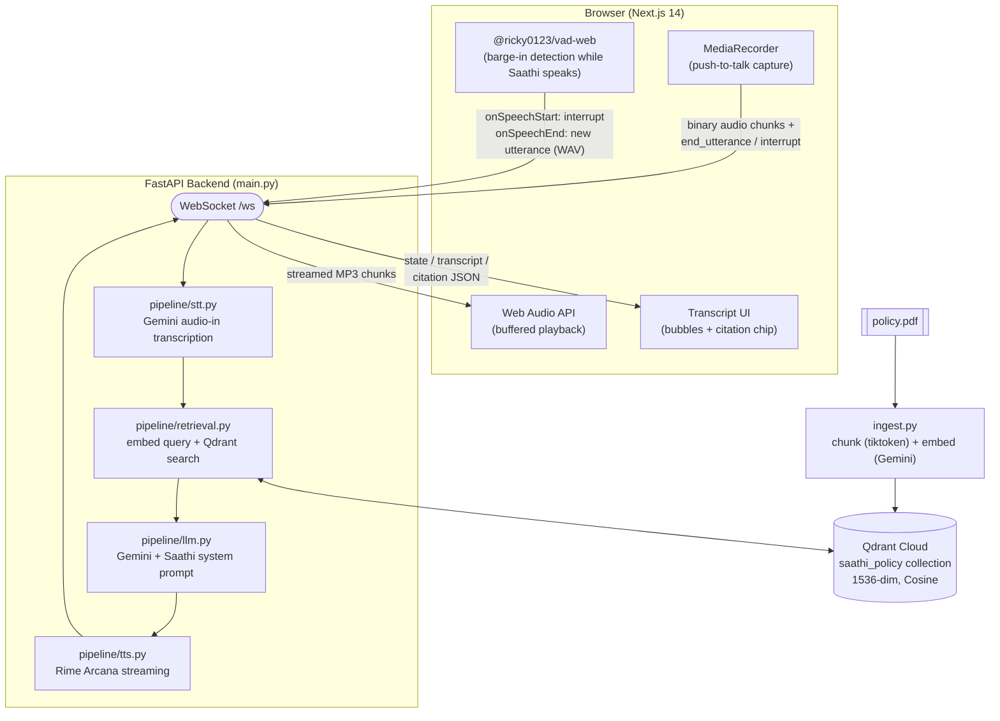

# Saathi (साथी)

**Pathway Hackathon 2026 — VoxForge track**

## Problem

When a family member is admitted to a hospital in India, the person handling
it is almost never a claims expert — they're standing in a corridor, scared,
holding a policy document full of English legal language they've never had
reason to read closely, while a billing counter asks for an advance they
may not have. Every minute spent decoding "Section 4.2," "TPA," or "room
rent sub-limit" is a minute the patient waits, and a wrong guess about what
the policy actually covers can cost tens of thousands of rupees or a delay
in cashless treatment.

Existing tools don't fit this moment. Insurer apps assume the user is
calm enough to read a PDF and navigate a portal; a call center puts them in
a queue; a web chatbot still requires typing in a stressful, often
one-handed, often noisy hospital corridor. What this moment actually calls
for is something closer to a knowledgeable relative on the phone — someone
who speaks the family's language (literally: Hindi, not insurance-English),
listens while they talk, and answers by pointing at what the *actual*
policy says, not a generic guess.

## Target user

**Meera, 42**, is waiting outside the ICU at a mid-sized city hospital. Her
father was admitted an hour ago after a fall. The billing desk has asked for
a ₹40,000 advance "just in case," and she has the family's health insurance
policy PDF on her phone but has never read it end to end — she doesn't know
what "cashless," "pre-authorization," or "sum insured" mean in practice, and
she has nobody free to call who does. She needs an answer in the next two
minutes, spoken in Hindi, that tells her exactly what to do next — not a
document to go read.

## Solution

Saathi is a voice-first Hindi companion: the user presses a mic button,
asks their question out loud (Hindi, or English/Punjabi mixed in — Saathi
still answers in Hindi), and gets a spoken answer grounded in their own
uploaded policy PDF, ending in one concrete next action ("go to the TPA
desk and ask for the pre-authorization form"). The user can interrupt
Saathi mid-sentence with a new question — voice activity detection
listens for that and cuts in immediately, the way a real conversation
would, rather than making them wait for her to finish.

Every answer cites the policy section it's grounded in, and Saathi never
invents coverage she isn't sure about — she says so and points the user to
confirm with the hospital's insurance desk instead.

## Architecture



## Tech stack

| Layer | Choice | Notes |
|---|---|---|
| Frontend | Next.js 14 (App Router) + TypeScript + Tailwind | Single-screen voice UI, dark/amber theme |
| Backend | FastAPI on Python 3.11 | WebSocket streaming, `asyncio.Task` cancellation for interruption |
| STT | Google Gemini (`gemini-3.6-flash`, audio input) | Swapped from Groq whisper-large-v3 — see *Known limitations* |
| LLM | Google Gemini (`gemini-3.6-flash`) | Swapped from Anthropic claude-sonnet-5 — see *Known limitations* |
| Embeddings | Google Gemini (`gemini-embedding-001`, 1536-dim) | Swapped from OpenAI text-embedding-3-small — see *Known limitations* |
| TTS | Rime Arcana (`modelId="arcana"`, `lang="hin"`, voice `anaya`) | Streaming Hindi speech synthesis, unchanged from plan |
| Vector DB | Qdrant Cloud (free tier) | Collection `saathi_policy`, recreated on each `ingest.py` run |
| Browser VAD | `@ricky0123/vad-web` (Silero model) | Barge-in detection during playback only |

> **Why three of these differ from the original plan:** Anthropic billing
> had no usable credit and Groq's signup flow was persistently broken
> during the build window, so the LLM and STT were moved to Gemini; the
> embedding model was also moved to Gemini once the LLM already was, to
> keep the whole pipeline on genuinely free infrastructure with zero cost
> risk during a live demo. Full context in each pipeline file's header
> comment (`backend/pipeline/*.py`).

## Setup

**Prerequisites:** Python 3.11 (not 3.12+ — see original build notes on
asyncio behavior differences), Node.js 18+, a Qdrant Cloud account, a
Gemini API key (free tier, no card — [aistudio.google.com/apikey](https://aistudio.google.com/apikey)),
and a Rime API key ([app.rime.ai/tokens](https://app.rime.ai/tokens)).

```bash
# 1. Backend setup
cd backend
py -3.11 -m venv .venv
./.venv/Scripts/activate   # or source .venv/bin/activate on macOS/Linux
pip install -r requirements.txt

# 2. Configure environment
cp .env.example .env
# fill in: GEMINI_API_KEY, RIME_API_KEY, QDRANT_URL, QDRANT_API_KEY

# 3. Add your policy PDF, then ingest it
#    (drop a file at backend/data/policy.pdf first)
python ingest.py

# 4. Run the backend
uvicorn main:app --reload --port 8000
```

```bash
# 5. Frontend setup (separate terminal)
cd frontend
npm install
npm run dev
```

Open **http://localhost:3000**, grant microphone permission when prompted,
and press the mic button to talk.

## Demo instructions

See [`docs/DEMO.md`](docs/DEMO.md) for the scripted 90-second walkthrough
and three scenarios judges can try hands-on at the booth.

## Known limitations

Being direct about these rather than letting a judge discover them mid-demo:

- **One policy, tested end to end.** `ingest.py` is built generically, but
  only one real policy PDF (a fictional sample, "AarogyaFirst Insurance")
  has been run through the full pipeline. Behavior on a genuinely different
  policy structure (e.g. a corporate group policy) is untested.
- **Hindi-only output, by design.** Saathi always responds in Devanagari
  Hindi even if the user speaks English or Punjabi — this is intentional
  per the product's premise, but it means English-speaking judges will hear
  Hindi regardless of what they ask in.
- **STT is Gemini, not a Hindi-specialized ASR model.** It handled every
  test utterance correctly in practice, but it isn't fine-tuned for Indian
  accents or code-switching the way a dedicated Hindi/Hinglish STT model
  would be — Groq whisper-large-v3 (the original plan) was never
  benchmarked against it since Groq's signup never resolved.
- **Interrupt latency measured at ~450–700ms, not strictly under the
  300ms target.** This is with the barge-in VAD's default (untuned)
  sensitivity settings — `positiveSpeechThreshold`/`redemptionMs` were
  never tuned for this specific microphone/room-noise setup due to time
  constraints. The interruption itself is real and does cancel in-flight
  generation (verified via a direct cancellation test — see
  `backend/pipeline/llm.py` usage in testing), it's just not
  sub-300ms yet.
- **Audio playback is buffered, not truly progressive.** The frontend
  waits for a complete response to finish streaming before decoding and
  playing it (`decodeAudioData` needs complete audio data to be reliable
  across browsers) — this adds a few seconds of perceived latency on top
  of an already multi-second STT→retrieval→generation pipeline.
- **Gemini's free tier has a low daily cap** (20 `generateContent`
  requests/day were hit during development testing on `gemini-3.6-flash`).
  This is a real risk for a live demo with back-to-back judge
  interactions — if it's hit, expect the assistant to stop responding with
  no visible error in the UI beyond an indefinite "thinking" state. See
  `docs/DEMO.md`'s fallback plan.
- **Normal turns are push-to-talk, not always-listening.** VAD only runs
  during playback (for interruption) — starting a *new*, non-interrupting
  turn always requires pressing the mic button, by design (matches the
  original phase plan's scope split between manual capture and automatic
  barge-in detection).
- **No multi-user isolation.** One WebSocket connection = one conversation
  history, in memory, lost on disconnect. Fine for a single-device demo,
  not a deployable multi-tenant design.
- **`backend/data/policy.pdf` is not in this repo.** It's a fictional
  sample document but was kept local-only rather than published; anyone
  running this from a fresh clone needs to supply their own policy PDF.

## Team + track

**Error404** — Pathway Hackathon 2026, VoxForge track.
